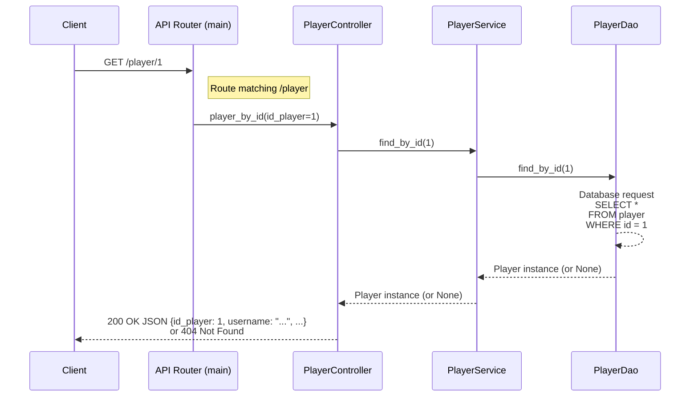

# Backend - Engine API

This is the core engine of the application. It is a layered REST API built with [FastAPI](https://fastapi.tiangolo.com/), responsible for game logic, player management, and data persistence.

## 🚀 Run the application

Command to run from the repository's root directory:

- Install all dependencies: `uv sync --project backend --all-extras`
  - option all-extras: including dev dependancies
- Launch the API in development mode: `uv run --project backend python src/main.py`

## 🏛️ Architecture

The backend follows a **Layered Architecture** (N-Tier) to ensure separation of concerns and maintainability:

- **Business Object** (`business_object/`) : Represents the pure domain entities
- **Controller** (`controller/`) : Handles HTTP requests and routing via FastAPI
- **Service** (`service/`) : Contains the core business logic
- **DAO** (`dao/`) : Manages database interactions
- **Schema** (`schema/`) : Data contract via [Pydantic](https://pydantic.dev/docs/validation/latest/get-started/) to ensure API requests and responses follow a strict structure

### Layers

Sequence diagram of the player retrieval flow through the application layers:

### Config files

In both the backend and frontend folders, you will find:

| Item                  | Description                                         | 
| --------------------- | --------------------------------------------------- | 
| logging_config.yml    | Configuration for the structured logging system.    | 
| pyproject.toml        | Project metadata and dependency definitions.        | 
| uv.lock               | Lockfile that ensures reproducible environments by pinning exact dependency versions. |
| \_\_init\_\_.py       | Marks a directory as a Python package, enabling module imports. |

## ⚒️ Development toolkit

### Debugging & Logs

The application uses a structured logging system. Logs are written to the `backend/logs/` directory and follow the format defined in `logging_config.yml`.

A custom `@log` decorator is available to automatically log method inputs and outputs, making it much easier to trace the flow of data through the services.

### Unit tests

To ensure tests are repeatable, safe, and **do not interfere with the real database**, we use a dedicated schema for unit testing.

The DAO unit tests use data from the `data/pop_db_test.sql` file.

This data is loaded into a separate schema (project_test_dao) so as not to pollute the other data.

- [ ] Lanch unit tests: `uv run --project backend pytest -v` 

It is also possible to generate test coverage using [Coverage](https://coverage.readthedocs.io/en/)

- [ ] `uv run --project backend coverage run -m pytest backend`
- [ ] `uv run --project backend coverage report -m`
- [ ] `uv run --project backend coverage html`
  - Download and open coverage_report/index.html

### Code quality

The **format on save** with [Ruff](https://docs.astral.sh/ruff/) is enabled by default in the workspace (cf. *.vscode/settings.json*).

- Analysis with **pylint**: `uv run --project backend --extra dev pylint --output-format=colorized --disable=C0114,C0411,C0415,W0718 $(git ls-files 'backend/**/*.py') --fail-under=7.5`
